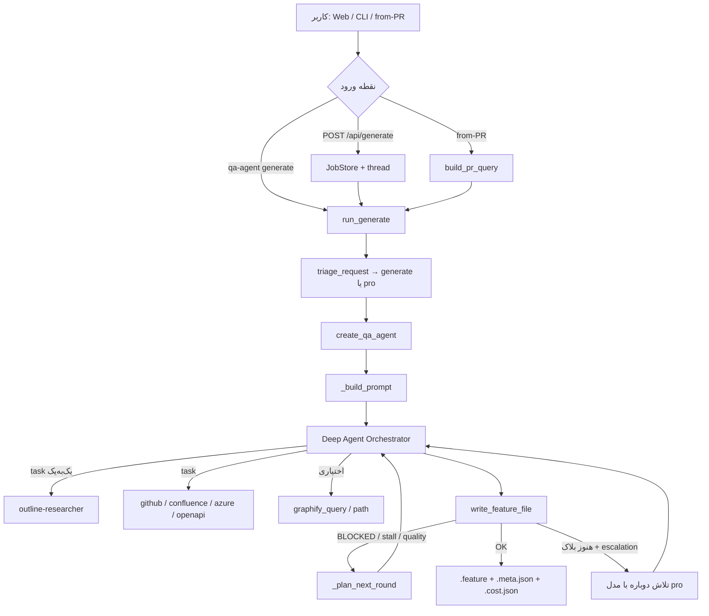

# جریان پرامپت و معماری ایجنت‌ها — QA Agent

این سند مسیر کامل یک درخواست کاربر را از لحظهٔ ورود تا فایل `.feature` نهایی توضیح می‌دهد: کجا می‌رود، هر ایجنت چه می‌گیرد و چه برمی‌گرداند، و کدام مدل/ابزار درگیر است.

---

## ۱. تصویر کلی

معماری روی **LangChain Deep Agents** (`create_deep_agent`) بنا شده است:

| نقش | نام | مدل | کار |
|-----|-----|-----|-----|
| هماهنگ‌کننده | Orchestrator | `generate` یا `pro` | تحقیق را تفویض می‌کند، یافته‌ها را جمع می‌کند، Gherkin می‌نویسد |
| پژوهشگرها | Subagents | `research` | هر کدام یک منبع (داک / PR / API) را می‌کاوند و گزارش ساخت‌یافته برمی‌گردانند |
| تریاژ | `triage_request` | `nano` (یا heuristic) | پیچیدگی درخواست را می‌سنجد و تِیر مدل اولیه را انتخاب می‌کند |

**نکته مهم:** فایل `gherkin_generator.md` منسوخ است. نوشتن Gherkin کار خودِ Orchestrator است، نه یک ساب‌ایجنت جدا.



---

## ۲. نقاط ورود پرامپت

### ۲.۱ وب UI — `src/qa_agent/server.py`

| متد | مسیر | بدنه | مسیر اجرا |
|-----|------|------|-----------|
| `POST` | `/api/generate` | `GenerateRequest`: `query`, `budget` (۲۰۰–۸۰۰۰، پیش‌فرض ۱۵۰۰), `dry_run` | Job در thread → `_run_job` → `run_generate` |
| `POST` | `/api/generate/pr` | `PRGenerateRequest`: repo + number | `_run_pr_job` → `run_generate_from_pr` |
| `GET` | `/api/jobs/{job_id}` | — | وضعیت / نتیجه |
| `GET` | `/api/jobs/{job_id}/stream` | — | SSE فعالیت‌ها (tool start/end، partial Gherkin، triage) |
| `POST` | `/api/index` | همگام‌سازی کانکتورها | `run_index` (جدا از generate) |

پروژهٔ فعال از `get_active_project_id()` روی Job ثبت می‌شود. تنظیمات از `preferences.json` همان پروژه می‌آید.

### ۲.۲ CLI — `src/qa_agent/main.py`

| فرمان | تابع | ادامه |
|-------|------|--------|
| `qa-agent generate "<query>"` | `generate()` | `run_generate(query, settings, budget)` |
| `qa-agent from-pr <repo> <number>` | `from_pr()` | `run_generate_from_pr` |
| `qa-agent serve` | `serve()` | uvicorn روی `qa_agent.server:app` |
| `qa-agent index …` | `index()` | فقط ایندکس؛ بدون حلقهٔ ایجنت |

### ۲.۳ هستهٔ مشترک

همهٔ مسیرهای زندهٔ تولید به این تابع می‌رسند:

```text
run_generate(query, settings, budget, on_activity?, request_query?)
```

در `src/qa_agent/agent.py`.

**تاریخچهٔ چت وجود ندارد.** هر اجرا از صفر با یک پیام کاربر ساخته‌شده توسط `_build_prompt` شروع می‌شود. فقط داخل همان اجرا ممکن است پیام‌های پیگیری (retry بلاک، nudge، refine کیفیت، escalation) اضافه شوند.

---

## ۳. قبل از Orchestrator: تریاژ و ساخت ایجنت

### ۳.۱ تریاژ — `src/qa_agent/triage.py`

تابع: `triage_request(query, settings)` → `TriageDecision`.

| فیلد | معنی |
|------|------|
| `complexity` | `simple` / `standard` / `complex` |
| `generate_role` | `pro` فقط اگر complex؛ وگرنه `generate` |
| `source` | `llm` / `heuristic` / `disabled` |

- اگر `qa_agent_triage` خاموش باشد → همیشه `standard` + نقش `generate`.
- در غیر این صورت مدل **nano** با پرامپت ثابت `_TRIAGE_PROMPT` JSON برمی‌گرداند؛ در خطا → `heuristic_triage` (نشانه‌های دامنهٔ وسیع، ویرگول‌ها، طول متن).

نتیجه در activity با `type: "triage"` و در گزارش هزینه ثبت می‌شود.

### ۳.۲ ساخت ایجنت — `create_qa_agent(...)`

ترتیب کار:

1. روشن/خاموش بودن کانکتورها:
   - Outline / GitHub: فقط فلگ preference
   - Confluence / Azure / OpenAPI: فلگ **و** `*_configured`
2. ساخت لیست toolها + تعریف subagents
3. بارگذاری پرامپت‌ها از `src/qa_agent/prompts/*.md` + تزریق context تنظیمات
4. مدل‌ها:
   - Orchestrator: `create_chat_model(resolve_model_ref(settings, generate_role), …)`
   - Researchers: `create_research_model(settings)` (نقش `research`)
5. `create_deep_agent(model=…, tools=all_tools, system_prompt=…, subagents=…)`

تفویض به ساب‌ایجنت‌ها از طریق ابزار داخلی Deep Agents به‌نام **`task`** انجام می‌شود. پرامپت اجبار می‌کند **همزمان فقط یک researcher** صدا زده شود (به‌خاطر rate limit گیت‌وی LLM).

---

## ۴. Orchestrator — مغز اصلی

### ۴.۱ پرامپت سیستم

فایل: `src/qa_agent/prompts/orchestrator.md`

به‌علاوهٔ بلوک تزریقی `_orchestrator_context(settings)` که شامل است:

- لیست ریپوهای GitHub / Azure
- آیا Confluence / Azure / OpenAPI کانفیگ شده‌اند
- `qa_agent_max_docs`, `qa_agent_max_prs_deep`, `qa_agent_token_budget`
- وضعیت هر کانکتور: `enabled` / `DISABLED`
- `prompt_hint` دامنه از `domain.py` (در صورت وجود)

**ماموریت (خلاصه):** پژوهش شواهد → چک‌لیست پذیرش → پلن تست اجرایی کامل به Gherkin (نه اسکلت نازک). بدون پرسیدن تأیید از کاربر.

**زبان خروجی:** روایت (عنوان سناریو، متن Given/When/Then، کامنت‌ها) به زبان درخواست کاربر؛ کلیدواژه‌های Gherkin، تگ‌ها، endpointها، HTTP، JSON به انگلیسی.

**اولویت شواهد:** PRD → Design/API → Architecture → PR diffs → Source code. PR مستندات را گسترش می‌دهد، جایگزین نمی‌کند.

### ۴.۲ پیام کاربر — `_build_prompt(query, effective_budget, settings)`

ساختار تقریبی:

```text
Generate Gherkin test cases for the following QA request.

REQUEST:
{query}

Follow your system instructions. In short:
1. Delegate to **outline-researcher** first …
2. Delegate to **github-researcher** …
…
N. Write Gherkin … Call write_feature_file once …

CRITICAL: Delegate to at most ONE researcher sub-agent at a time. …
```

گام‌ها فقط برای کانکتورهای روشن ساخته می‌شوند. بودجهٔ اختیاری graphify در متن ذکر می‌شود.

### ۴.۳ ابزارهای مستقیم Orchestrator

اتحاد همهٔ toolهای کانکتورهای فعال + graphify + خروجی:

| گروه | ابزارها |
|------|---------|
| Outline | `corpus_map`, `outline_research_bundle`, `outline_get_document`, `corpus_search_docs`, `outline_search_titles` |
| GitHub | `github_discover_relevant_prs`, `github_list_pull_requests`, `github_get_pr_file_list`, `github_search_pull_requests`, `github_get_pull_request`, `github_get_pr_changes`, `github_get_file_content` |
| Confluence | `confluence_research_bundle`, `confluence_get_page` |
| Azure | `azure_search_work_items`, `azure_get_work_item`, `azure_wiki_search`, `azure_wiki_get_page`, `azure_discover_relevant_prs`, `azure_get_pull_request`, `azure_get_pr_changes`, `azure_get_file_content` |
| OpenAPI | `openapi_research_bundle`, `openapi_get_operation` |
| Graphify | `graphify_query`, `graphify_path` |
| خروجی | `write_feature_file` |

در عمل Orchestrator ترجیح می‌دهد پژوهش را با `task` به ساب‌ایجنت بسپارد؛ خودش بیشتر سنتز و نوشتن را انجام می‌دهد.

### ۴.۴ خروجی Orchestrator

| خروجی | توضیح |
|--------|--------|
| فراخوانی `write_feature_file` | Gherkin + منابع + چک‌لیست → فایل‌ها |
| پیام نهایی AI | متن `response` در نتیجهٔ Job |
| Activity stream | برای UI: شروع/پایان tool، `partial_gherkin`، triage، escalation |

پارامترهای `write_feature_file`:

| آرگومان | معنی |
|---------|------|
| `gherkin_content` | متن کامل Feature |
| `query` | معمولاً نادیده گرفته می‌شود؛ `request_query` بایند‌شده برای slug/meta اولویت دارد |
| `sources_json` | `[{kind, id, title, url}, …]` |
| `acceptance_checklist_json` | `[{id, layer, summary}, …]` — IDهای PRD مثل E-1 / B-8 عیناً |
| `write_attempt` | از ۱؛ بعد از هر BLOCKED زیاد می‌شود |

در صورت موفقیت: `{slug}.feature`, `{slug}.meta.json`, `{slug}.cost.json` در `qa_agent_output_dir` پروژه.

---

## ۵. ساب‌ایجنت‌های پژوهشگر

الگوی مشترک:

1. مدل جدا (`research`)
2. `system_prompt` = فایل `.md` + `_*-context(settings)`
3. Orchestrator با ابزار `task` و نام ساب‌ایجنت صدا می‌زند
4. خروجی: گزارش markdown ساخت‌یافته در تاریخچهٔ پیام‌ها (نه فایل جدا)

### ۵.۱ `outline-researcher`

| | |
|--|--|
| پرامپت | `prompts/outline_researcher.md` + `_outline_context` |
| نقش | پژوهش مستندات → چک‌لیست پذیرش + wire facts |
| ابزارها (`research_only=True`) | `corpus_map`, `outline_research_bundle`, `outline_get_document`, `corpus_search_docs` |
| محدودیت | middleware ابزارهای FS را قطع می‌کند: `grep`, `glob`, `ls`, `write_file`, `edit_file`, `execute` |
| ورودی | عبارت فیچر از Orchestrator |
| خروجی نوعی | Relevant Documents، Acceptance Checklist، Derived Coverage Criteria، Wire Facts، Edge Cases، Coverage Matrix، Conflicts، Final Recommendation |

اصل: مستندات منبع حقیقت‌اند؛ endpoint جعلی نسازد؛ bundle را یک‌بار اجرا کند.

داخل bundle معمولاً `expand_query_terms` (مدل nano) برای گسترش اصطلاحات جستجو صدا زده می‌شود.

### ۵.۲ `github-researcher`

| | |
|--|--|
| پرامپت | `prompts/github_researcher.md` + `_github_context` |
| نقش | کشف PR مرتبط، deep-read دیف، قراردادهای قابل مشاهده |
| ابزارها | مجموعهٔ `github_*` بالا |
| خروجی نوعی | PR Triage، Deep-read Findings، Consolidated Behavior Matrix، Final Recommendation |

اصل: اگر ریپو کانفیگ شده، بعد از داک متوقف نشود؛ PRهای merged را ترجیح دهد؛ دیف بخواند نه فقط عنوان.

### ۵.۳ `confluence-researcher`

| | |
|--|--|
| پرامپت | `prompts/confluence_researcher.md` + `_confluence_context` |
| ابزارها | `confluence_research_bundle`, `confluence_get_page` |
| Fallback | جستجوی کورپوس وقتی Confluence در دسترس نیست |
| خروجی | Relevant Pages، Checklist، Derived Coverage، Wire Facts، Edge Cases، Conflicts، Recommendation |

### ۵.۴ `azure-researcher`

| | |
|--|--|
| پرامپت | `prompts/azure_researcher.md` + `_azure_context` |
| نقش | Boards + Wiki برای الزامات، سپس PRهای Azure برای کد |
| ابزارها | مجموعهٔ `azure_*` |
| خروجی | Acceptance Checklist، PR Triage، Behavior Matrix، Wire Facts، Recommendation |

### ۵.۵ `openapi-researcher`

| | |
|--|--|
| پرامپت | `prompts/openapi_researcher.md` + `_openapi_context` |
| نقش | قرارداد API از OpenAPI/Swagger |
| ابزارها | `openapi_research_bundle`, `openapi_get_operation` |
| خروجی | Relevant Endpoints، Checklist، Derived Coverage، Wire Facts، Edge Cases، Recommendation |

اصل: method/path/auth/schema/status را عیناً از spec بردارد؛ چیزی اختراع نکند.

### ۵.۶ Gherkin «ایجنت»؟

`prompts/gherkin_generator.md` فقط می‌گوید قوانین به `orchestrator.md` منتقل شده‌اند. اعتبارسنجی و نوشتن از مسیر `write_feature_file` → `try_write_feature_file` / `validate_before_write` انجام می‌شود.

---

## ۶. حلقهٔ اجرا، retry و escalation

مسیر: `run_generate` → `_execute_run` → (`_run_agent_streaming_with_retry` یا `_run_agent_with_retry`).

بعد از هر دور، `_plan_next_round` تصمیم می‌گیرد:

| وضعیت | اقدام |
|--------|--------|
| نوشتن موفق + بدون (یا تمام‌شده) quality warning | توقف — Done |
| نوشتن موفق + quality warnings و بودجهٔ refine | پیام `_quality_refine_prompt` |
| `write_feature_file` با خروجی BLOCKED | `_blocked_retry_prompt` با `write_attempt` بعدی |
| هیچ write موفقی نبود (stall) | `_stall_nudge_prompt` |
| سقف `max_write_attempts` یا `max_reprompts` | توقف |

سقف‌ها از `RunLimits.from_settings` (`qa_agent_max_write_attempts`, `qa_agent_max_reprompts`, `qa_agent_quality_refine_rounds`).

اگر در پایان هنوز `write_blocked` و `qa_agent_escalation` روشن و مدل `pro` با مدل فعلی فرق داشته باشد:

1. Activity با `type: "escalation"`
2. ساخت دوبارهٔ ایجنت با `generate_role="pro"`
3. پرامپت `_escalation_prompt` = `_build_prompt` + یادداشت خطای بلاک قبلی

---

## ۷. لایهٔ مدل‌ها — `src/qa_agent/models/llm.py`

| نقش | تابع / کاربرد |
|-----|----------------|
| `nano` | تریاژ + query expansion |
| `research` | همهٔ researcherها |
| `generate` | Orchestrator پیش‌فرض |
| `pro` | تریاژ complex از ابتدا، یا escalation بعد از بلاک |

توابع کلیدی: `resolve_model_ref`, `create_chat_model`, `create_research_model`, `create_nano_model`, `create_generate_model`, `create_pro_model`.

RPM مشترک از `qa_agent_llm_rpm`؛ پشتیبانی از router / provider سفارشی در Settings.

---

## ۸. ایندکس، بازیابی و تغذیهٔ ابزارها

### ۸.۱ ایندکس آفلاین — `indexing.py` → `run_index`

| فلگ / sync | هدف |
|------------|------|
| Outline / Confluence / OpenAPI sync | `corpus/docs/*.md` |
| GitHub / Azure clone | `corpus/code/` |
| `with_graph` | `graphify-out/` |
| — | بازسازی ایندکس جستجو (BM25 ± embeddings) |

### ۸.۲ بازیابی در زمان generate

1. **`query_expansion.expand_query_terms`** — nano → اصطلاحات انگلیسی؛ کش در `projects/<id>/.cache/query_expansion/`
2. **`retrieval.py`** — BM25 + اختیاری embeddings + RRF روی کورپوس؛ برای `corpus_search_docs`
3. **`corpus_map`** — نقشهٔ لایه‌بندی‌شده برای جهت‌گیری Outline
4. **API زنده** — کلاینت‌های Outline / Confluence / GitHub / Azure / OpenAPI (+ کش فایل در صورت وجود)
5. **Graphify** — پرسش اختیاری از گراف دانش ایندکس‌شده

ایندکس آماده‌سازی است؛ پژوهش در generate بیشتر با toolهای زنده (+ fallback کورپوس) است.

---

## ۹. پروژه، Preferences و دامنه

### پروژه‌ها — `projects.py`

- رجیستری: `projects/registry.json`
- هر پروژه: `preferences.json`, `.cache/`, `corpus/`, `output/`, `graphify-out/`
- `get_settings(project_id)` → `apply_preferences` → `apply_project_paths`

### Preferences — `preferences.py`

فیلدهای UI روی `.env` می‌نشینند، از جمله: credentialها، نردبان مدل، فلگ‌های ساب‌ایجنت، بودجه‌ها، triage/escalation/query_expansion.

**اثر روی پرامپت:** کدام ساب‌ایجنت ساخته شود؛ چه ریپو/حدی در context تزریق شود؛ کدام مدل برای هر نقش.

### دامنه — `domain.py`

`load_domain_rules()` → `prompt_hint` در context همهٔ ایجنت‌ها؛ همچنین aliasها / الگوهای کیفیت در toolها.

---

## ۱۰. جریان end-to-end با ورودی/خروجی هر مرحله

| مرحله | ورودی | خروجی |
|-------|--------|--------|
| کاربر تایپ می‌کند | متن فارسی/انگلیسی فیچر | `query` |
| Job / CLI | `query`, `budget` | شروع `run_generate` |
| Triage | `query` (تا ۱۲۰۰ کاراکتر برای LLM) | `generate_role`, complexity |
| `_build_prompt` | `query` + تنظیمات کانکتور | پیام user برای Orchestrator |
| System orchestrator | `orchestrator.md` + config | رفتار و قوانین نوشتن |
| `task` → researcher | عبارت فیچر + ابزارهای خودش | گزارش markdown ساخت‌یافته |
| (اختیاری) graphify | سؤال مفهومی | زیرگراف محدود |
| سنتز Orchestrator | گزارش‌های researchers | چک‌لیست + Gherkin در ذهن مدل |
| `write_feature_file` | gherkin + sources + checklist | OK یا `BLOCKED: …` |
| Retry / escalate | پیام اصلاحی یا مدل pro | تلاش دوباره |
| Finalize | نتیجهٔ agent + فایل‌ها | Job: response, gherkin, paths, cost, triage |

### مسیر from-PR

`build_pr_query(repo, number)`:

- `rich_query`: عنوان، توضیح، لیست فایل‌ها + دستور deep-read همان PR
- `clean_query`: برای نام فایل / متادیتا (`PR owner/repo#n: title`)

سپس `run_generate(rich_query, request_query=clean_query)`.

---

## ۱۱. Activity و UI

`activity.py` رویدادهای tool را به پیام‌های فارسی/خوانا برای UI تبدیل می‌کند (`activity_from_tool_start` / `_end`, `phase_for_tool`).

فازهای تقریبی: triage → research (هر کانکتور) → generate → write.

در streaming، هنگام `write_feature_file` اگر محتوا قابل استخراج باشد، event با `type: "partial_gherkin"` برای پیش‌نمایش زنده فرستاده می‌شود.

---

## ۱۲. نقشهٔ فایل‌های کلیدی

| مسیر | نقش |
|------|-----|
| `src/qa_agent/main.py` | CLI |
| `src/qa_agent/server.py` | FastAPI، Job، SSE |
| `src/qa_agent/jobs.py` | `GenerationJob`, `JobStore` |
| `src/qa_agent/agent.py` | کارخانهٔ ایجنت، پرامپت‌ها، حلقهٔ اجرا، PR query |
| `src/qa_agent/prompts/orchestrator.md` | سیستم‌پرامپت Orchestrator |
| `src/qa_agent/prompts/*_researcher.md` | سیستم‌پرامپت researchers |
| `src/qa_agent/prompts/gherkin_generator.md` | منسوخ |
| `src/qa_agent/triage.py` | انتخاب تِیر مدل |
| `src/qa_agent/models/llm.py` | ساخت چت‌مدل‌ها |
| `src/qa_agent/query_expansion.py` | گسترش جستجو |
| `src/qa_agent/retrieval.py` | جستجوی کورپوس |
| `src/qa_agent/indexing.py` | همگام‌سازی منابع |
| `src/qa_agent/config.py` / `preferences.py` / `projects.py` | تنظیمات و ایزوله‌سازی پروژه |
| `src/qa_agent/domain.py` | قوانین دامنه / hint پرامپت |
| `src/qa_agent/tools/*.py` | ابزارهای کانکتور + خروجی |
| `src/qa_agent/activity.py` | نگاشت tool → UI |
| `src/qa_agent/cost.py` | توکن و هزینه |
| `web/` | فرانت که `/api/generate` و stream را صدا می‌زند |

---

## ۱۳. Cheat-sheet نام‌ها

**توابع:** `run_generate`, `run_generate_from_pr`, `create_qa_agent`, `_build_prompt`, `_plan_next_round`, `_run_agent_streaming_with_retry`, `triage_request`, `expand_query_terms`, `write_feature_file` / `try_write_feature_file`, `run_index`, `build_pr_query`.

**نام ساب‌ایجنت‌ها (برای `task`):** `outline-researcher`, `github-researcher`, `confluence-researcher`, `azure-researcher`, `openapi-researcher`.

**نقش‌های مدل:** `nano`, `research`, `generate`, `pro`.

**کلیدهای تزریقی / آرگومان‌های مهم:** `REQUEST`, `effective_budget`, connector enabled/DISABLED, domain `prompt_hint`, `write_attempt`, `sources_json`, `acceptance_checklist_json`, `gherkin_content`, `request_query`.

---

## ۱۴. قوانین رفتاری که از پرامپت‌ها می‌آید (خلاصهٔ اجرایی)

1. اول داک (Outline / Confluence / Azure Boards+Wiki)، بعد PR و OpenAPI **یکی‌یکی**.
2. هر ID چک‌لیست حداقل یک Scenario با `@acceptance-{ID}` (یا `@wip-{ID}`)؛ برای معیارهای پرریسک چند سناریو (happy / edge / failure / …).
3. یک سناریو به ازای هر ID = شکست کیفیت.
4. IDهای مستند (E-\* / B-\*) را به AC-\* تغییر نام نده.
5. هدر Feature با legend تگ‌ها (`@p0`/`@p1`/`@p2`, `@manual`/`@e2e`, …) و `Background` محیط اجباری است.
6. بعد از سنتز دقیقاً یک‌بار `write_feature_file` (و فقط در BLOCKED دوباره تلاش).
7. از کاربر سؤال نپرس؛ خودمختار اصلاح کن.

---

*این سند بر اساس کد فعلی در `src/qa_agent/` نوشته شده است. اگر پرامپت‌ها یا فلگ‌های کانکتور عوض شوند، بخش‌های ۴–۵ و ۱۲ را به‌روز کنید.*
